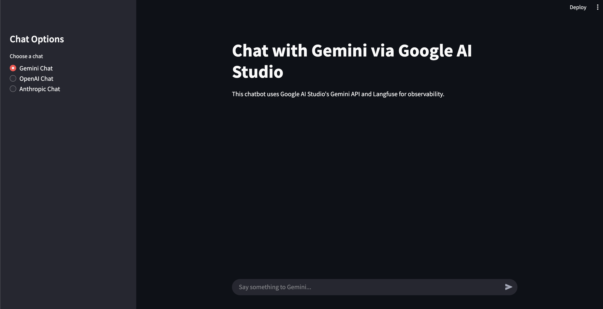

# Langfuse demo

## How to install

To install the packages make sure to have [uv](https://docs.astral.sh/uv/getting-started/installation/) installed.

After having installed uv, please run:

```bash
uv sync
```

This will install the required python libraries. To activate the virtual environment please run:

- MacOS

```bash
source .venv/bin/activate
```

- Windows
```bash
.venv\Scripts\activate
```

## How to run

Make sure to have these environment variables:

```bash
GEMINI_API_KEY
LANGFUSE_SECRET_KEY
LANGFUSE_PUBLIC_KEY
LANGFUSE_HOST
OPENAI_API_KEY
ANTHROPIC_API_KEY
```


To run the app please run:

```bash
streamlit run main.py
```

This is how it should look like

